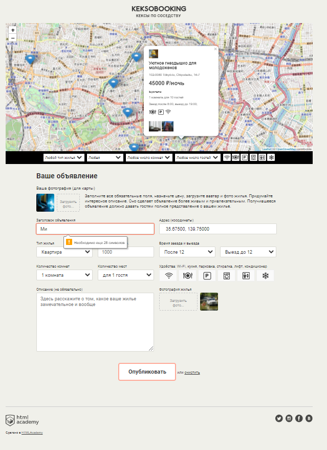

# Проект "Кексобукинг"

Настоящий проект выполнен в рамках курса "JavaScript. Профессиональная разработка веб-интерфейсов" от HTML Academy.

В качестве исходного материала была предоставлена сверстанная и стилизованная страница.

Цель проекта - реализовать функционал страницы в соответствии с техническим заданием на JavaScript.

В итоге был реализован следующий функционал:
### 1. Последовательная загрузка и активация элементов страницы:
- первой загружается карта, подключенная при помощи стороннего API Leaflet;
- затем с сервера загружаются данные об объявлениях, которые показываются на карте в виде интерактивных меток;
- внешний вид и поведение меток при взаимодействии соотвествует ТЗ;
- фильтры объявлений и форма отправки пользовательского объявления активируются только в случае успешной загрузки карты и объявлений с сервера;
- в случае ошибки при загрузке данных показывается уведомление;

### 2. Валидация формы пользовательского объявления в соответствии с логикой, прописанной в ТЗ:
- обязательные и необязательные поля ввода;
- тип содержимого и ограничения по размеру контента полей ввода;
- допустимое содержимое отдельных полей ввода зависит от других логически связанных полей;
- выбор адреса на карте осуществляется перетаскиванием специальной метки;
- невозможность отправки формы с неполными или некорректными данными;
- в форме подачи объявления показывается превью аватарки пользователя и фотографии помещения при загрузке их пользователем;

### 3. Отправка формы на сервер:
- отправка формы с помощью технологии AJAX (а если точнее, то fetch API) без перезагрузки страницы;
- показ сообщения пользователю об успешной или неудачной отправке формы в соответствии с заготовленными в html шаблонами template;
- в случае успешной отправки форма приводится в исходное состояние;
- в случае неудачной отправки данные сохраняются, чтобы их можно было откорректировать;

### 4. Отображение и фильтрация объявлений на карте:
- метки на карте отображаются в соответствии с координатами, полученными с сервера;
- при клике по метке объявления показывается подробная информация об объявлении в разворачивающемся балуне;
- информация может быть получена с сервера в неполном объеме, но при этом ничто не должно ломаться и выглядеть неадекватно;
- при открытии соседнего объявления, смене фильтра и т.д. текущее открытое объявление должно сворачиваться;
- отображаемые на карте объявления (не более 10 одновременно) должны соответствовать всем выбранным фильтрам, а если активных фильтров нет, то показываться в порядке, полученном с сервера;
- при смене фильтра перерисовка объявлений должна происходить не чаще, чем раз в 500мс - устранение дребезга (debounce);
